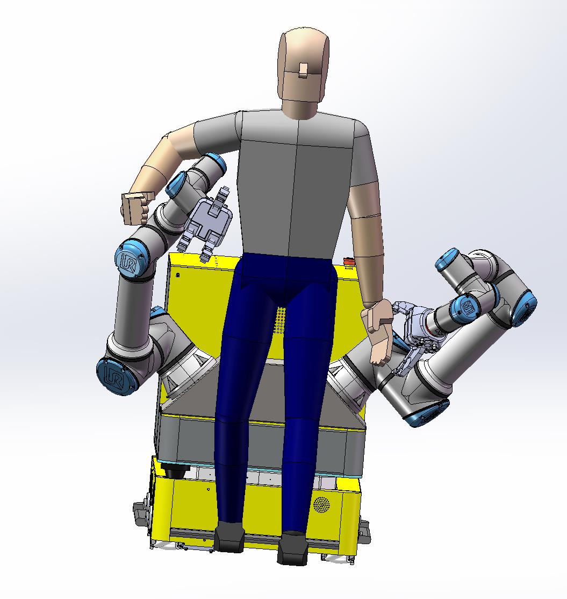

# 周报8-15

---
## 本周任务 ##
- 设计solidworks双臂部署，绘制solidworks模型，并在solidworks模型内使用假人和机器人作了一个简单的demo演示
- 

- 初步确定机械臂的排布，传感器在此基础上在gazebo中仿真确定
- 在璐姐的代码基础上作了简单的simulink仿真，完成了画圆任务，并自己用python做了简单的画圆仿真
- 完善了调研报告中搀扶模式分析模块
- 学习机器人学的基础知识

---  
## 下周任务 ##
- 仿真中看懂力交互部分并实现
- 仿真实现双臂一个画圆，一个画方，移动底盘走小方形（待定）
- 运动学、逆运动学建模，推导工作空间
- 完成视觉、激光、力觉的多传感器部署
- 看双臂协作有关论文
